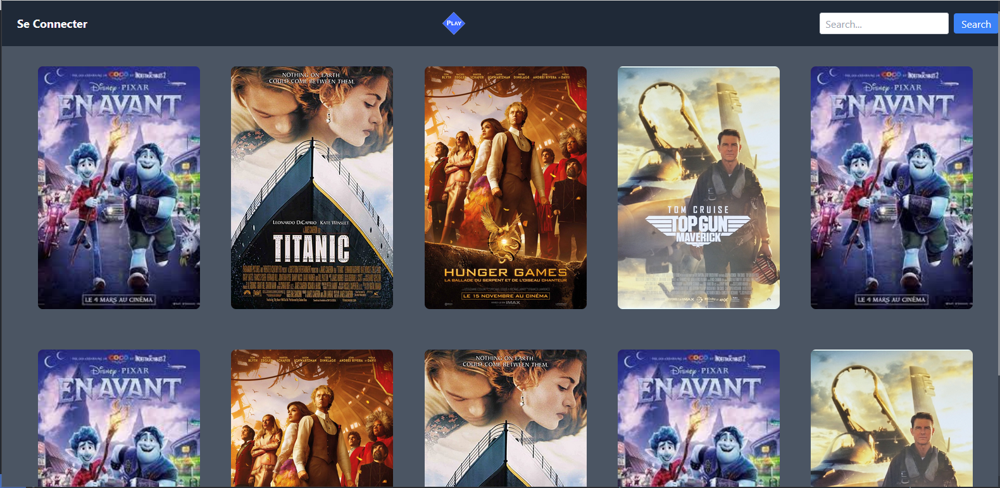

<<<<<<< HEAD
# GETFLIX 🎞️

Lien vers la version live [la version live](https://playstreaming314.000webhostapp.com/index.php).

Lien vers [le code source sur GitHub](https://github.com/Yaeshin/getflixProject).

Lien du [Trello](https://trello.com/b/JsVj0voB/projet-getflix)

Debut du projet : 27/11/2023

Fin du projet : 15/11/2023

## Objectifs de la mission
GetFlix est un projet exhaustif englobant à la fois le backend et le frontend, visant à concrétiser nos compétences acquises dans le développement tant côté frontend que backend.

 Le projet a pour objectif de mettre en pratique les compétences en HTML, CSS, JavaScript, et PHP. Calqué sur le model des plateformes renommées telles que Netflix, Amazon Prime Video, Popcorn Time, GetFlix ambitionne de créer un site de streaming moderne avec des fonctionnalités incontournables et optionnelles, reflétant les meilleures pratiques de l'industrie."

## Fonctionnalités

Obligatoirs: 
- Système de session : inscription, connexion/déconnexion.
-  niveaux d'autorisation : les inscrits peuvent commenter le contenu. Possibilité d'ajouter d'autres niveaux d'autorisation (ex : Admin).
- Barre de recherche et tri par filtres.
Code sécurisé.

Optionnelles:

- Gestion des mots de passe perdus.
- Back office pour la gestion des utilisateurs et des commentaires (CRUD).
- Création d'une page ou section affichant les meilleurs films avec l'API de The Movie Database.
- Intégration d'une newsletter avec Mailchimp.
Informations diverses
- Les vidéos ne seront pas hébergées sur le site, un simple lien vers la bande-annonce YouTube suffira.

## Liste des technologies utilisées

Frond-End:
- HTML
- CSS
- TailwindCss [lien](https://tailwindcss.com/) 
- Javascript

Backend:
- PHP
- API themoviedatabase [lien](https://developer.themoviedb.org/reference/intro/getting-started)
- The movie db API
- MYSQL

## Bugs connus et corrections éventuelles apportées

## Auteurs

Thomas Syben [github](https://github.com/Harbingar)

Célestin Sivixay [github](https://github.com/Yaeshin)

Cédric Berthet [github](https://github.com/cebe0210)

Loa Soumahoro [github](https://github.com/LoaGnadjouSoumahoro)

